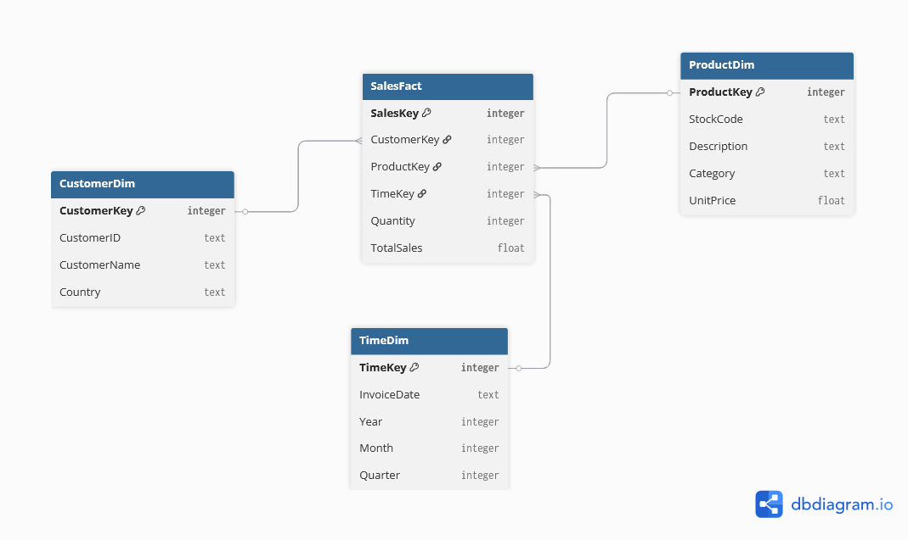

# DSA-2040_Practical_Exam_Hana_555
This repository contains my DSA 2040 (US 2025) practical exam project, demonstrating data warehousing and data mining using Python and SQL, including star schema design, ETL, OLAP queries, and machine learning classification.

---

## Overview
This repository contains the complete submission for the DSA 2040 end-semester practical exam. It covers two main sections:  

1. **Data Warehousing (50 marks)**  
   - Design of a star schema for a retail company  
   - ETL process implementation using Python and SQLite  
   - OLAP queries and analysis with visualizations  

2. **Data Mining (50 marks)**  
   - Data preprocessing and exploration of the Iris dataset  
   - Clustering using K-Means  
   - Classification (Decision Tree & KNN) and Association Rule Mining  

---

## Datasets
- **Retail Dataset:** Generated synthetic data (~1000 rows) resembling the UCI Online Retail dataset.  
- **Iris Dataset:** Loaded from scikit-learn.  
- **Synthetic Transactional Data:** Created for association rule mining.  

---

## Folder Structure

DSA_2040_Practical_Exam_Hana_555/
│
├─ `etl_retail.py`          - ETL implementation for retail DW  
├─ `retail_dw.db`           - SQLite database (fact & dimension tables)  
├─ `preprocessing_iris.py`  - Iris preprocessing, exploration  
├─ `clustering_iris.py`     - K-Means clustering implementation  
├─ `classification_iris.py` - Classification and rule mining  
├─ `sql_queries.sql`        - OLAP and other SQL queries  
├─ `images/`                - Visualizations and schema diagrams  
│   ├─ `schema.png`  
│   ├─ `sales_by_country.png`  
│   ├─ `pairplot_iris.png`  
│   └─ `clusters.png`  
└─ `README.md`


# 1. Data Warehousing

## 1.1 Design of a Star Schema for a Retail Company

**Scenario:** Designing a data warehouse for a retail company that sells products across categories. The company tracks sales, customers, products, and time.  

**Requirements:**  
- Support queries like total sales by product category per quarter, customer demographics analysis, and inventory trends.

### 1.1.1 Star Schema Design

**Fact Table:** `Sales`  
- Columns: `SalesKey` (PRIMARY KEY), `Quantity`, `TotalSales`  
- Foreign Keys: `CustomerKey`, `ProductKey`, `TimeKey`  

**Dimension Tables:**  
- `TimeDim`: Columns: `TimeKey`, `InvoiceDate`, `Year`, `Quarter`, `Month`  
- `CustomerDim`: Columns: `CustomerKey`, `CustomerID`, `CustomerName`, `Country`  
- `ProductDim`: Columns: `ProductKey`, `StockCode`, `Description`, `Category`, `UnitPrice`  

**Schema Diagram:**  


### 1.1.2 Explanation for Choosing Star Schema Over Snowflake

The star schema was chosen because it simplifies queries and improves query performance by denormalizing dimension tables. It is easier for business analysts to understand and use for reporting, as all relevant dimension attributes are in single tables.  

### 1.1.3 SQL CREATE TABLE Statements

The SQL `CREATE TABLE` statements for the fact and dimension tables (assuming SQLite syntax) can be found in:  
[Schema_retail.sql](Section_1/Task_1_Data_Warehouse_Design/Schema_retail.sql)


## 1.2 ETL Process Implementation

**Dataset:** Synthetic data designed to mimic the structure and scale of the target dataset with similar columns:  

| Column       | Description                                      |
|--------------|--------------------------------------------------|
| InvoiceNo    | Unique invoice identifier                        |
| StockCode    | Product code                                     |
| Description  | Product description                              |
| Quantity     | Number of items purchased                        |
| InvoiceDate  | Date of purchase                                 |
| UnitPrice    | Price per item                                   |
| CustomerID   | Unique customer identifier                        |
| Country      | Customer's country                               |

**Dataset Features:**  
- Row count: ~500–1000 (practicality)  
- Quantities: 1–50, Prices: 1–100  
- Dates span 2 years  
- 100 unique customers  
- 5–10 countries  
- Includes missing values, categorical columns, and outliers for Quantity and UnitPrice  
- Seeded for reproducibility  

**Generation code:** `[Path to synthetic data generation script]`

---

### 1.2.1 Extract
- Python (pandas & Faker) was used to generate the synthetic dataset as a DataFrame.  
- Missing values handled for `Description` and `Country`.  
- Data types corrected, e.g., `InvoiceDate` converted to datetime.  

<details>


   
<summary>📄 Extract Code Snippet</summary>

```python
# Handle missing values & convert data types
df_synthetic['Description'] = df_synthetic['Description'].fillna('Unknown Product')
df_synthetic['Country'] = df_synthetic['Country'].fillna('Unknown Country')
df_synthetic['InvoiceDate'] = pd.to_datetime(df_synthetic['InvoiceDate'], errors='coerce')

# Save synthetic data
df_synthetic.to_csv("synthetic_retail_dataset.csv", index=False)
logging.info("Synthetic dataset exported as 'synthetic_retail_dataset.csv'")
```

### 1.2.2 Transform

**Transformations Applied:**  
- Added a new column: `TotalSales = Quantity * UnitPrice`  
- Filtered data for sales in the last year (assuming current date = 2025-08-12)  
- Handled outliers by removing rows where `Quantity <= 0` or `UnitPrice <= 0`  

<details>


   
<summary>📄 Transform Code Snippet</summary>

```python
# Calculate total sales
df_transformed['TotalSales'] = df_transformed['Quantity'] * df_transformed['UnitPrice']

# Remove outliers
df_transformed = df_transformed[df_transformed['Quantity'] > 0]
df_transformed = df_transformed[df_transformed['UnitPrice'] > 0]

# Filter for the last 12 months
current_date = pd.Timestamp("2025-08-12")
one_year_ago = current_date - pd.DateOffset(years=1)
df_transformed = df_transformed[
    (df_transformed['InvoiceDate'] >= one_year_ago) & 
    (df_transformed['InvoiceDate'] <= current_date)
]

# Export transformed dataset
df_transformed.to_csv("transformed_retail_dataset.csv", index=False)
logging.info("Transformed dataset exported as 'transformed_retail_dataset.csv'")
```


</details>


### 1.2.3 Load

**Loading Process:**  
- Used `sqlite3` in Python to create a database  
- Loaded data into:

  * 1 Fact Table: `SalesFact`  
  * 3 Dimension Tables: `ProductDim`, `CustomerDim`, `TimeDim`  

<details>

   
<summary>📄 Load Code Snippet</summary>

```python
import sqlite3
import pandas as pd

# Connect to SQLite database
conn = sqlite3.connect("retail.db")
cur = conn.cursor()

# Execute external schema
with open("Schema2.sql", "r") as f:
    schema_sql = f.read()
cur.executescript(schema_sql)

# Insert into dimension tables
customer_dim = df_transformed[['CustomerID', 'CustomerName', 'Country']].drop_duplicates()
customer_dim.to_sql('CustomerDim', conn, if_exists='append', index=False)

product_dim = df_transformed[['StockCode', 'Description', 'Category']].drop_duplicates()
product_dim.to_sql('ProductDim', conn, if_exists='append', index=False)

# Merge keys for fact table
cust_keys = pd.read_sql("SELECT CustomerKey, CustomerID FROM CustomerDim", conn)
prod_keys = pd.read_sql("SELECT ProductKey, StockCode FROM ProductDim", conn)

fact_df = df_transformed.merge(cust_keys, on='CustomerID').merge(prod_keys, on='StockCode')
fact_df = fact_df[['InvoiceNo', 'InvoiceDate', 'Quantity', 'UnitPrice', 'CustomerKey', 'ProductKey']]

# Load fact table
fact_df.to_sql('SalesFact', conn, if_exists='append', index=False)

# Commit and close connection
conn.commit()
conn.close()
logging.info("Data loaded successfully into SQLite database.")
```


</details>


### 1.2.4 Full ETL Function

**Overview:**  
- Modular ETL function that can be applied to any dataset  
- Performs **full ETL** by calling `run_etl_export_only()`  
- Logs the number of rows processed at each stage  
- Handles errors gracefully  
- Exports:

  * Synthetic dataset → `[Path placeholder]`  
  * Transformed dataset → `[Path placeholder]`  
  * SQLite database → `[Path placeholder]`  

<details>

   
<summary>📄 Example ETL Log Output</summary>

```
2025-08-14 23:46:38,674 - INFO - Starting ETL process...
2025-08-14 23:46:38,730 - INFO - Synthetic dataset exported as 'synthetic_retail_dataset.csv'
2025-08-14 23:46:38,731 - INFO - Rows after extraction: 1000
2025-08-14 23:46:38,748 - INFO - Transformed dataset exported as 'transformed_retail_dataset.csv'
2025-08-14 23:46:38,750 - INFO - Rows after transformation: 493
2025-08-14 23:46:38,751 - INFO - Loading data into SQLite database using external schema...
2025-08-14 23:46:38,994 - INFO - Data loaded successfully into SQLite database.
2025-08-14 23:46:38,996 - INFO - ETL process completed: only synthetic, transformed, and .db exported.
```


</details>


**Post-load Data:**  
- Fact and dimension tables can be found at:

  * `[SalesFact path]`  
  * `[CustomerDim path]`  
  * `[ProductDim path]`  
  * `[TimeDim path]`  

**For a deep dive into the ETL process:** `[Path placeholder for full ETL documentation or script]`


