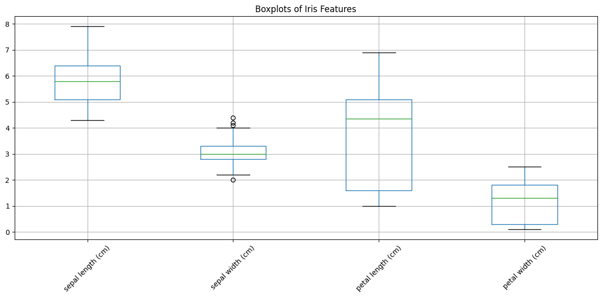
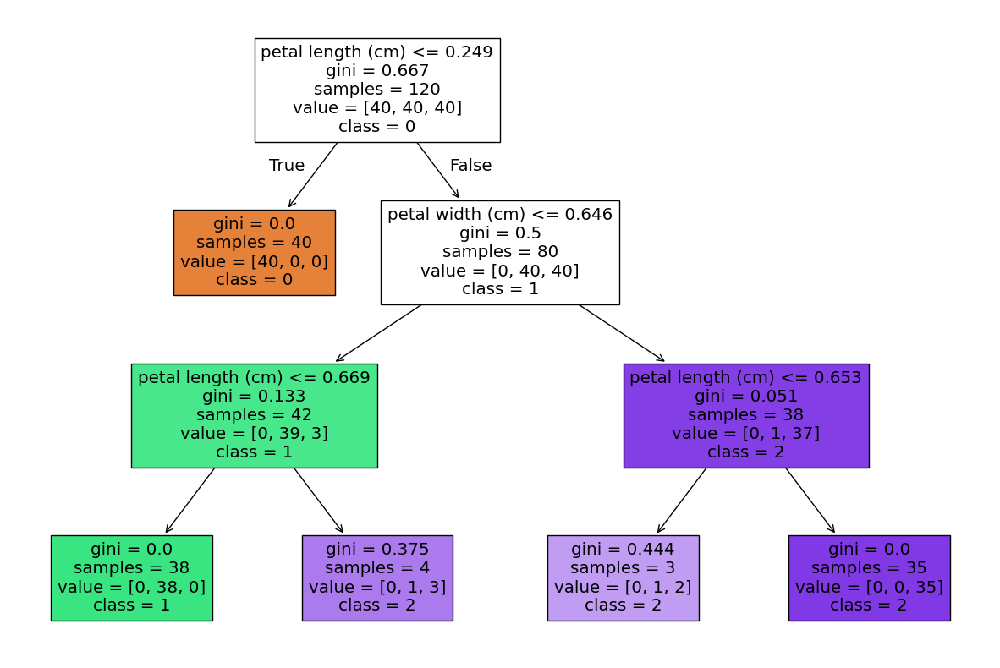

# DSA-2040_Practical_Exam_Hana_555
---

## Overview
This repository contains the complete submission for the DSA 2040 end-semester practical exam. It covers two main sections:  

1. **Data Warehousing**  
   - Design of a star schema for a retail company  
   - ETL process implementation using Python and SQLite  
   - OLAP queries and analysis with visualizations  

2. **Data Mining**  
   - Data preprocessing and exploration of the Iris dataset  
   - Clustering using K-Means  
   - Classification (Decision Tree & KNN) and Association Rule Mining  

---

## Datasets
- **Retail Dataset:** Generated synthetic data (~1000 rows) resembling the UCI Online Retail dataset.  
- **Iris Dataset:** Loaded from scikit-learn.  
- **Synthetic Transactional Data:** Created for association rule mining.
  
---
## Repository Structure
---
DSA_2040_Practical_Exam_Hana_555/
├─ Section_1
│ ├─ Task_1_Data_Warehouse_Design/
│ │ ├─ Schema_diagram.png
│ │ ├─ Schema_retail.sql
│ ├─ Task_2_ETL_Process_Implementation/
│ │ ├─ Datasets/
│ │ ├─ PostLoad_Fact_and_Dimension_tables/
│ │ ├─ etl_retail.ipynb
│ │ ├─ retail.db
│ ├─ Task_3_OLAP_Queries_and_Analysis/
│ ├─ OLAP_Queries_output_csv/
│ ├─ Bar_Chart_of_Sales_by_Country.jpg
│ ├─ OLAP_Queries.sql
│ ├─ OLAP_Queries_Analysis_Report.pdf
├─ Section_2
│ ├─ Task_1_Data_Preprocessing_and_Exploration/
│ │ ├─ Screenshots/
│ │ ├─ Visualizations/
│ │ ├─ preprocessing_iris.ipynb
│ │ ├─ iris_preprocessed.csv
│ ├─ Task_2_Clustering/
│ │ ├─ Visualizations/
│ │ ├─ Analysis_Report.pdf
│ │ ├─ clustering_iris.ipynb
│ ├─ Task_3_Classification_and_Association_Rule_Mining/
│ ├─ Screenshots/
│ ├─ Visualizations/
│ ├─ Generated_transactions.csv
│ ├─ mining_iris_basket.ipynb
├─ .gitignore
├─ Debugging_Notes.pdf
├─ LICENSE
├─ README.md
             
---
# 1. Data Warehousing
---
## 1.1 Design of a Star Schema for a Retail Company

**Scenario:** Designing a data warehouse for a retail company that sells products across categories. The company tracks sales, customers, products, and time.  

**Requirements:**  
- Support queries like total sales by product category per quarter, customer demographics analysis, and inventory trends.

---

### 1.1.1 Star Schema Design

**Fact Table:** `Sales`  
- Columns: `SalesKey` (PRIMARY KEY), `Quantity`, `TotalSales`  
- Foreign Keys: `CustomerKey`, `ProductKey`, `TimeKey`  

**Dimension Tables:**  
- `TimeDim`: Columns: `TimeKey`, `InvoiceDate`, `Year`, `Quarter`, `Month`  
- `CustomerDim`: Columns: `CustomerKey`, `CustomerID`, `CustomerName`, `Country`  
- `ProductDim`: Columns: `ProductKey`, `StockCode`, `Description`, `Category`, `UnitPrice`  

**Schema Diagram:**  


---
### 1.1.2 Explanation for Choosing Star Schema Over Snowflake

The star schema was chosen because it simplifies queries and improves query performance by denormalizing dimension tables. It is easier for business analysts to understand and use for reporting, as all relevant dimension attributes are in single tables.  

---
### 1.1.3 SQL CREATE TABLE Statements

The SQL `CREATE TABLE` statements for the fact and dimension tables (assuming SQLite syntax) can be found in:  
[Schema_retail.sql](Section_1/Task_1_Data_Warehouse_Design/Schema_retail.sql)

---
## 1.2 ETL Process Implementation

**Dataset:** Synthetic data designed to mimic the structure and scale of the target dataset with similar columns:  

| Column       | Description                                      |
|--------------|--------------------------------------------------|
| InvoiceNo    | Unique invoice identifier                        |
| StockCode    | Product code                                     |
| Description  | Product description                              |
| Quantity     | Number of items purchased                        |
| InvoiceDate  | Date of purchase                                 |
| UnitPrice    | Price per item                                   |
| CustomerID   | Unique customer identifier                        |
| Country      | Customer's country                               |

**Dataset Features:**  
- Row count: ~500–1000 (practicality)  
- Quantities: 1–50, Prices: 1–100  
- Dates span 2 years  
- 100 unique customers  
- 5–10 countries  
- Includes missing values, categorical columns, and outliers for Quantity and UnitPrice  
- Seeded for reproducibility  

**Generation code:** [etl_retail.ipynb](Section_1/Task_2_ETL_Process%20_Implementation/etl_retail.ipynb)

---

### 1.2.1 Extract
- Python (pandas & Faker) was used to generate the synthetic dataset as a DataFrame.  
- Missing values handled for `Description` and `Country`.  
- Data types corrected, e.g., `InvoiceDate` converted to datetime.  


```python
# Handle missing values & convert data types
df_synthetic['Description'] = df_synthetic['Description'].fillna('Unknown Product')
df_synthetic['Country'] = df_synthetic['Country'].fillna('Unknown Country')
df_synthetic['InvoiceDate'] = pd.to_datetime(df_synthetic['InvoiceDate'], errors='coerce')

# Save synthetic data
df_synthetic.to_csv("synthetic_retail_dataset.csv", index=False)
logging.info("Synthetic dataset exported as 'synthetic_retail_dataset.csv'")
```

---

### 1.2.2 Transform

**Transformations Applied:**  
- Added a new column: `TotalSales = Quantity * UnitPrice`  
- Filtered data for sales in the last year (assuming current date = 2025-08-12)  
- Handled outliers by removing rows where `Quantity <= 0` or `UnitPrice <= 0`  

```python
# Calculate total sales
df_transformed['TotalSales'] = df_transformed['Quantity'] * df_transformed['UnitPrice']

# Remove outliers
df_transformed = df_transformed[df_transformed['Quantity'] > 0]
df_transformed = df_transformed[df_transformed['UnitPrice'] > 0]

# Filter for the last 12 months
current_date = pd.Timestamp("2025-08-12")
one_year_ago = current_date - pd.DateOffset(years=1)
df_transformed = df_transformed[
    (df_transformed['InvoiceDate'] >= one_year_ago) & 
    (df_transformed['InvoiceDate'] <= current_date)
]

# Export transformed dataset
df_transformed.to_csv("transformed_retail_dataset.csv", index=False)
logging.info("Transformed dataset exported as 'transformed_retail_dataset.csv'")
```
---

### 1.2.3 Load

**Loading Process:**  
- Used `sqlite3` in Python to create a database  
- Loaded data into:

  * 1 Fact Table: `SalesFact`  
  * 3 Dimension Tables: `ProductDim`, `CustomerDim`, `TimeDim`  


```python
import sqlite3
import pandas as pd

# Connect to SQLite database
conn = sqlite3.connect("retail.db")
cur = conn.cursor()

# Execute external schema
with open("Schema2.sql", "r") as f:
    schema_sql = f.read()
cur.executescript(schema_sql)

# Insert into dimension tables
customer_dim = df_transformed[['CustomerID', 'CustomerName', 'Country']].drop_duplicates()
customer_dim.to_sql('CustomerDim', conn, if_exists='append', index=False)

product_dim = df_transformed[['StockCode', 'Description', 'Category']].drop_duplicates()
product_dim.to_sql('ProductDim', conn, if_exists='append', index=False)

# Merge keys for fact table
cust_keys = pd.read_sql("SELECT CustomerKey, CustomerID FROM CustomerDim", conn)
prod_keys = pd.read_sql("SELECT ProductKey, StockCode FROM ProductDim", conn)

fact_df = df_transformed.merge(cust_keys, on='CustomerID').merge(prod_keys, on='StockCode')
fact_df = fact_df[['InvoiceNo', 'InvoiceDate', 'Quantity', 'UnitPrice', 'CustomerKey', 'ProductKey']]

# Load fact table
fact_df.to_sql('SalesFact', conn, if_exists='append', index=False)

# Commit and close connection
conn.commit()
conn.close()
logging.info("Data loaded successfully into SQLite database.")
```
---

### 1.2.4 Full ETL Function

**Overview:**  
- Modular ETL function that can be applied to any dataset  
- Performs **full ETL** by calling `run_etl_export_only()`  
- Logs the number of rows processed at each stage  
- Handles errors gracefully  
- Exports:

  **Synthetic dataset** → [synthetic_retail_dataset.csv](Section_1/Task_2_ETL_Process%20_Implementation/Datasets/synthetic_retail_dataset.csv)
  
  **Transformed dataset** → [transformed_retail_dataset.csv](Section_1/Task_2_ETL_Process%20_Implementation/Datasets/transformed_retail_dataset.csv)
  
  **SQLite database** → [retail_db](Section_1/Task_2_ETL_Process%20_Implementation/Datasets/retail_db)

---

**ETL Log Output**

```
2025-08-14 23:46:38,674 - INFO - Starting ETL process...
2025-08-14 23:46:38,730 - INFO - Synthetic dataset exported as 'synthetic_retail_dataset.csv'
2025-08-14 23:46:38,731 - INFO - Rows after extraction: 1000
2025-08-14 23:46:38,748 - INFO - Transformed dataset exported as 'transformed_retail_dataset.csv'
2025-08-14 23:46:38,750 - INFO - Rows after transformation: 493
2025-08-14 23:46:38,751 - INFO - Loading data into SQLite database using external schema...
2025-08-14 23:46:38,994 - INFO - Data loaded successfully into SQLite database.
2025-08-14 23:46:38,996 - INFO - ETL process completed: only synthetic, transformed, and .db exported.
```
---

## **Post-load Data:**  

- Fact and dimension tables can be found at:

 * SalesFact → [SalesFact.csv](https://github.com/ibtj21/DSA-2040_Practical_Exam_Hana_555/blob/main/Section_1/Task_2_ETL_Process%20_Implementation/PostLoad_Fact_and_Dimention_tables/SalesFact.csv)
   
 * CustomerDim → [CustomerDim.csv](https://github.com/ibtj21/DSA-2040_Practical_Exam_Hana_555/blob/main/Section_1/Task_2_ETL_Process%20_Implementation/PostLoad_Fact_and_Dimention_tables/CustomerDim.csv)
 
 * ProductDim → [ProductDim.csv](https://github.com/ibtj21/DSA-2040_Practical_Exam_Hana_555/blob/main/Section_1/Task_2_ETL_Process%20_Implementation/PostLoad_Fact_and_Dimention_tables/ProductDim.csv)

 * TimeDim → [TimeDim.csv](https://github.com/ibtj21/DSA-2040_Practical_Exam_Hana_555/blob/main/Section_1/Task_2_ETL_Process%20_Implementation/PostLoad_Fact_and_Dimention_tables/TimeDim.csv)


**For a deep dive into the ETL process:** [etl_retail.ipynb](Section_1/Task_2_ETL_Process%20_Implementation/etl_retail.ipynb)

---

## 1.3 OLAP Queries and Analysis

Using the Data Warehouse from Task 2:

### 1.3.1 OLAP-style SQL Queries


**i. Roll-up: Total sales by country and quarter** 

```sql
SELECT 
    c.country,            -- Country name
    d.quarter,            -- Quarter of the year
    SUM(f.total_sales) AS total_sales  -- Total sales summed
FROM fact_sales f
JOIN dim_customer c ON f.customer_id = c.customer_id
JOIN dim_date d ON f.date_id = d.date_id
GROUP BY c.country, d.quarter
ORDER BY c.country, d.quarter;
````

**Output CSV:** [Total Sales by Country and Quarter](Section_1/Task_3_OLAP_%20Queries_and_Analysis/OLAP_Queries_output_csv/TotalSalesByCountryQuarter.csv)

---

**ii. Drill-down: Sales details for a specific country (UK) by month**


```sql
SELECT 
    d.year,               -- Year of sale
    d.month,              -- Month of sale
    p.name AS product_name, -- Product name
    f.quantity,           -- Quantity sold
    f.total_sales         -- Sales amount
FROM fact_sales f
JOIN dim_customer c ON f.customer_id = c.customer_id
JOIN dim_date d ON f.date_id = d.date_id
JOIN dim_product p ON f.product_id = p.product_id
WHERE c.country = 'UK'   -- Filter for UK
ORDER BY d.year, d.month, p.name;
```

**Output CSV:** [UK Monthly Sales](Section_1/Task_3_OLAP_%20Queries_and_Analysis/OLAP_Queries_output_csv/uk_monthly_sales.csv)

---


**iii. Slice: Total sales for Electronics category**

```sql
SELECT 
    SUM(f.total_sales) AS total_sales
FROM fact_sales f
JOIN dim_product p ON f.product_id = p.product_id
WHERE p.category = 'Electronics';  -- Only Electronics products
```

**Output CSV:** [Total Sales Electronics](Section_1/Task_3_OLAP_%20Queries_and_Analysis/OLAP_Queries_output_csv/TotalSales_Electronics.csv)

---

### 1.3.2 Visualization

**A bar chart of sales by country using Matplotlib was created.**


---

### 1.3.3 Analysis of Results

#### Analysis of Total Sales Using OLAP Queries

This report summarizes the results of OLAP queries performed on the sales data warehouse, including roll-up, drill-down, and slice analyses.

| Analysis Type | Description | Key Findings | Implications |
|---------------|-------------|--------------|--------------|
| **Roll-up: Total Sales by Country & Quarter** | Aggregates sales by country and quarter | **High Sales:** Germany, Norway, France, Italy <br> **Moderate Sales:** Netherlands, Portugal, Spain, UK <br> **Low Sales:** Unknown Country | Identifies strong markets, seasonal trends, and top-performing regions |
| **Drill-down: Monthly Sales for Specific Country (UK)** | Examines sales at monthly level | Peak months: January, September <br> Low months: February, August | Supports tactical planning, promotions, and stock allocation |
| **Slice: Electronics Category Sales** | Isolates sales for Electronics | Total sales: **144,339.15** | Informs product-specific strategies: inventory, marketing, product development |
| **Insights & Decision-Making Support** | Consolidates sales, customer, and product data | Enables fast OLAP queries for roll-up, drill-down, slice | Supports strategic marketing, inventory, and operational decisions |
| **Effect of Synthetic Data** | Analysis based on synthetic dataset | Patterns may not match real-world markets perfectly | Safely tests OLAP queries and decision-support processes without exposing sensitive information |

For a more comprehensive query analysis report, visit:  
[OLAP Queries Analysis Report](Section_1/Task_3_OLAP_%20Queries_and_Analysis/OLAP_Queries_Analysis_Report.pdf)

---

# 2 Data Mining

## 2.1 Data Preprocessing and Exploration

### **Modular Functions for Data Preprocessing**

To ensure a structured, reusable, and transparent workflow, the following **modular functions** were implemented for preprocessing the Iris dataset. Using functions makes it easier to maintain, test, and reuse the code across different datasets or models:

| Function Name                   | Description                                                                 |
|--------------------------------|-----------------------------------------------------------------------------|
| `load_iris_data()`             | Loads the Iris dataset into Python.                                        |
| `check_missing_values()`       | Checks for any missing values in the dataset.                              |
| `encode_labels()`              | Encodes the class labels into numerical format if required.                |
| `normalize_features()`         | Applies Min-Max scaling to normalize feature values.                       |
| `summary_statistics()`         | Computes descriptive statistics (mean, std, min, max) for all features.    |
| `visualize_pairplot()`         | Generates pair plots to visualize feature interactions and class separations. |
| `visualize_correlation_heatmap()` | Creates a correlation heatmap to identify relationships between features. |
| `visualize_boxplots()`         | Draws boxplots to detect potential outliers in the features.               |
| `cap_outliers_species()`       | Applies outlier capping based on species-specific thresholds.              |
| `split_train_test()`           | Splits the dataset into training and testing sets (e.g., 80/20 split).     |
| `remove_outliers_iqr()`        | Removes outliers from the dataset using the IQR method.                    |


These functions make the preprocessing pipeline **modular, readable, and consistent**, which is crucial for reproducibility and efficient analysis.

The **Iris dataset** from **scikit-learn** was used. This dataset includes the following features:

- **Sepal length (cm)**
- **Sepal width (cm)**
- **Petal length (cm)**
- **Petal width (cm)**

---

### 2.1.1 Load the Dataset in Python Using Scikit-learn

The modular function `load_iris_data()` was used.  


---

### 2.1.2 Preprocess

**i. Handle any missing values**  

The modular function `check_missing_values()` was used. 


**ii. Normalize features using Min-Max scaling**  


**iii. Encode the class label**
 
 Using Label Encoding:

| Original Species | Encoded Value |
|-----------------|---------------|
| setosa          | 0             |
| versicolor      | 1             |
| virginica       | 2             |
---

### 2.1.3 Explore

**i. Compute summary statistics**  


---

**ii. Visualize: Pairplot (using Seaborn) and Correlation Heatmap**

---

- **Pairplot**
  
  

---

- **Correlation Heatmap**

  
 
 
---

**iii. Identify any potential outliers using boxplots**  



---

### Identifying Outliers with Boxplots

**Boxplot Interpretation:**
- **Box:** Represents the interquartile range (IQR: 25th to 75th percentile).  
- **Line inside the box:** Median (50th percentile).  
- **Whiskers:** Typically extend to 1.5 × IQR above Q3 and below Q1.  
- **Points beyond whiskers:** Considered **potential outliers**.

**How to identify outliers:**
- Any data point lying **above the upper whisker** or **below the lower whisker** is a potential outlier.  
- In our case, there are 4 data points identified as outliers in the sepal width.

---

### 2.1.4 Write a Function to Split Data into Train/Test (80/20)

Here is the modular function:

```python
from sklearn.model_selection import train_test_split

def split_train_test(df, feature_cols, label_col_encoded='species_encoded', test_size=0.2, random_state=42):
    # Separate features and encoded labels
    X = df[feature_cols]
    y = df[label_col_encoded]
    
    # Split data into train/test with stratification by class labels
    X_train, X_test, y_train, y_test = train_test_split(
        X, y, test_size=test_size, random_state=random_state, stratify=y
    )
    
    # Print sample counts
    print(f"Train samples: {X_train.shape[0]}, Test samples: {X_test.shape[0]}")
    return X_train, X_test, y_train, y_test
feature_cols = df.columns[:-1].tolist()
X_train, X_test, y_train, y_test = split_train_test(df_no_outliers, feature_cols)
```
**Output:**

Train samples: 116  
Test samples: 30
---
## 2.2 Clustering  
**Preprocessed Data from Task 1 was Used.**

### **Modular Functions Used for Clustering**

Using modular functions ensures clean, reusable, and maintainable code throughout the clustering process.

| Function Name                | Description                                                                 |
|-----------------------------|-----------------------------------------------------------------------------|
| `load_preprocessed_data()`  | Loads the preprocessed Iris dataset for clustering analysis.               |
| `kmeans_clustering_evaluate()` | Applies K-Means clustering and evaluates the results using metrics like inertia and silhouette score. |
| `plot_elbow_curve()`        | Plots the elbow curve to determine the optimal number of clusters.         |
| `plot_clusters_scatter()`   | Visualizes the resulting clusters using a scatter plot.                    |

---

### 2.2.1 Apply K-Means Clustering (k = 3)

#### i. Fit the Model on Features (Exclude Class)

```python
from sklearn.cluster import KMeans
from sklearn.metrics import adjusted_rand_score

def kmeans_clustering_evaluate(X, y_true, k=3):
    # Initialize KMeans with specified number of clusters and random seed
    kmeans = KMeans(n_clusters=k, random_state=42)
    
    # Fit the model to the feature data
    kmeans.fit(X)
    
    # Get the cluster labels assigned by KMeans
    clusters = kmeans.labels_
    
    # Evaluate clustering using Adjusted Rand Index (compares predicted clusters with true labels)
    ari = adjusted_rand_score(y_true, clusters)
    
    # Return the cluster labels, ARI score, and the fitted KMeans model
    return clusters, ari, kmeans 

# Perform KMeans clustering on the data and evaluate with ARI
clusters, ari, kmeans_model = kmeans_clustering_evaluate(X, y_true, k=3)

# Print the ARI score with 4 decimal places
print(f"Adjusted Rand Index (ARI) for k=3: {ari:.4f}")
```

ii. Predict clusters and compare with actual classes using Adjusted Rand Index (ARI)

**Adjusted Rand Index (ARI) for k = 3:** 0.7163  
This indicates a strong alignment between predicted clusters and true labels, with some overlap, particularly between Versicolor and Virginica.

### Contingency Table (True vs Predicted)

| True | 0  | 1  | 2  |  
|------|----|----|----|  
| 0    | 0  | 50 | 0  |  
| 1    | 3  | 0  | 47 |  
| 2    | 36 | 0  | 14 |  

- Cluster 1 perfectly captured species 0 (Setosa).  
- Species 1 (Versicolor) mostly went to Cluster 2, with 3 misclassified as Cluster 0.  
- Species 2 (Virginica) is split across Clusters 0 and 2, showing significant overlap with Versicolor.  
---

### 2.2.2 Experiment: Try k = 2 and k = 4; plot elbow curve to justify optimal k.


---

### 2.2.3 Visualize Clusters — Scatter Plot of Petal Length vs Width, Colored by Cluster  


---

### 2.2.4 Analysis of Clustering Results  

The clustering produced an **ARI of 0.7163**, showing a good, but not perfect, match with actual classes. Setosa was clearly separated, while Versicolor and Virginica overlapped, causing some misclassifications. The overlap highlights typical real-world challenges where groups share similar features.

K-Means effectively identifies distinct groups (like Setosa), but struggles with overlapping ones. This is common in use cases like **customer segmentation**, where borderline cases exist. Normalization improved feature balance but couldn’t fully resolve natural class overlap, affecting accuracy.

---

### **Real-World Implications**  
K-Means is useful for separating clearly distinct categories but may underperform when classes share overlapping features. In real scenarios such as **customer profiling** or **market segmentation**, combining K-Means with more features or advanced models can improve clustering outcomes.
  
To get the detailed report, visit:  
[Analysis_Report.pdf](Section_2/Task_2_Clustering/Analysis_Report.pdf)


## 2.3 Classification and Association Rule Mining

### 2.3.1 Classification

**i.** Train a Decision Tree classifier (scikit-learn) on train set.  
**→** Predict on test set; compute accuracy, precision, recall, F1-score.

**Decision Tree Metrics:**  
`{'accuracy': 0.97, 'precision': 0.97, 'recall': 0.97, 'f1_score': 0.97}`

**Classification Report:**
          precision    recall  f1-score   support

       0       1.00      1.00      1.00        10  
       1       1.00      0.90      0.95        10  
       2       0.91      1.00      0.95        10  

accuracy                           0.97        30  


**ii.** Visualize the tree (using `plot_tree`)... Max depth = 3 was used to prevent overfitting  


---

### 2.3.2 Compare with another classifier

## Decision Tree vs KNN Performance on Iris Dataset

#### Overall Metrics
- Both Decision Tree (DT) and KNN achieve **97% accuracy, precision, recall, and F1-score**.  
- Weighted averages show **similar overall performance**, though class-level differences exist.

---

#### Per-Class Performance

| Class         | DT Recall | KNN Recall | Notes                                                                    |
|---------------|-----------|------------|--------------------------------------------------------------------------|
| 0 (Setosa)    | 1.00      | 1.00       | Perfectly separable, both models classify correctly                      |
| 1 (Versicolor)| 0.90      | 1.00       | DT missed 1 instance; KNN captured all but had minor false positives     |
| 2 (Virginica) | 1.00      | 0.90       | KNN misclassified 1 boundary point; DT had minor false positives         |

---

#### Reason for Differences
- **Decision Tree**: global splits → may slightly underfit overlapping classes.  
- **KNN**: local, distance-based → flexible, captures boundary points better, but sensitive to neighbors.  
- Differences are minor because **Iris dataset is small and mostly well-separated**, with only a few borderline samples.

---

#### Conclusion
- Both models perform very well.  
- DT is interpretable and simple; KNN is flexible and handles subtle boundaries better.  
- Minor class-level differences are due to how each model handles overlapping feature regions.

### 2.3.2 Association Rule Mining

#### Data Generation for Association Rule Mining

A synthetic shopping dataset was generated with **20–50 transactions**, each containing **3–8 randomly selected items** from a pool of **20 unique products**. To mimic realistic shopping behavior, **frequent item pairs** like `['milk', 'bread']` and `['diapers', 'beer']` were intentionally injected with higher occurrence. This ensured the presence of **strong, interpretable associations** suitable for effective rule mining.

---

#### Modular Functions Used in Association Rule Mining

- **`generate_transactions(dataframe)`**  
  Converts raw data into a list of itemsets (transactions) for mining.

- **`encode_transactions(transactions)`**  
  One-hot encodes transactions into a binary format required for Apriori.

- **`generate_rules(encoded_df, min_support=0.1, min_threshold=0.5)`**  
  Applies Apriori to find frequent itemsets and generate strong association rules.

---

#### i. Apply Apriori Algorithm

Find rules with `min_support = 0.2` and `min_confidence = 0.5`.

**Explanation: What the Rule Means**

An association rule like `(milk, soda) → (bread)` suggests that **if a customer buys milk and soda, they are likely to buy bread**.


**Code Example:**

```python
def generate_rules(df, min_support=0.2, min_confidence=0.5):
    frequent_itemsets = apriori(df, min_support=min_support, use_colnames=True)
    rules = association_rules(frequent_itemsets, metric='confidence', min_threshold=min_confidence)
    rules_sorted = rules.sort_values(by='lift', ascending=False)
    return rules_sorted

if __name__ == "__main__":
    # Generate synthetic transactions
    transactions = generate_transactions(n_transactions=40, seed=42)

    # Encode transactions
    df_encoded = encode_transactions(transactions)

    # Generate rules
    rules = generate_rules(df_encoded, min_support=0.2, min_confidence=0.5)

    # Display top 5 rules by lift
    print("Top 5 Association Rules by Lift:\n")
    print(rules[['antecedents', 'consequents', 'support', 'confidence', 'lift']].head(5))
```

Output:


#### ii. Analysis

### Analysis of Association Rule: `(milk, soda) → (bread)`

- **Support:** `0.20` → 20% of all transactions contain milk and soda together with bread.  
- **Confidence:** `1.00` → Every transaction that contains both milk and soda also contains bread.  
- **Lift:** `1.82` → Customers buying milk and soda are **1.82 times more likely** to also buy bread compared to random chance.

---

**Implications for Retail:**

- This rule suggests a strong association between buying **milk, soda, and bread**.
- A retailer could use this information to **optimize product placement**, such as placing bread near milk and soda in the store to encourage additional purchases.
- It can also inform **cross-selling or bundling strategies**: offering promotions like “Buy milk and soda, get a discount on bread” could increase sales of bread.
- This insight can further guide **inventory management**, ensuring sufficient stock for items that are frequently purchased together.

